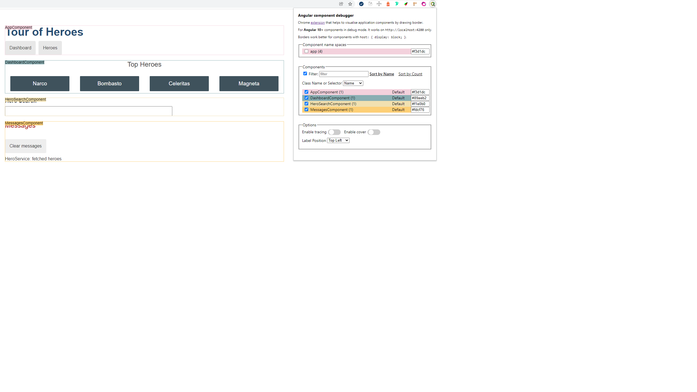

## Angular component outliner

Chrome extension that aims to help visualise application components by drawing a border around components.

It is possible to choose between component namespaces determined by prefix (for example `app` - application components, `mat` - Angular Material components, etc.) or particular components.

There are few options you can choose: class name or selector and label position.

It is possible to filter by component name.
Number in parentheses after component name show instances count of given component.

###### Example:

## Installation

- Clone the repository
- Run `npm install`
- Run `npm run start` 
- Open `chrome://extensions/` in your browser and drag and drop the `dist` folder.
- 

