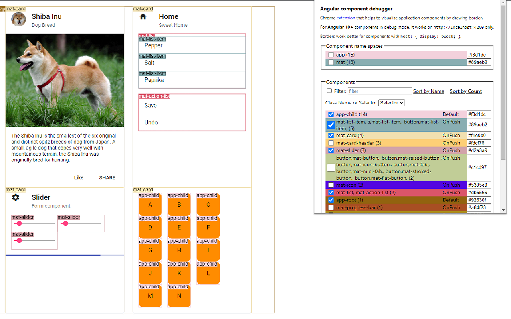
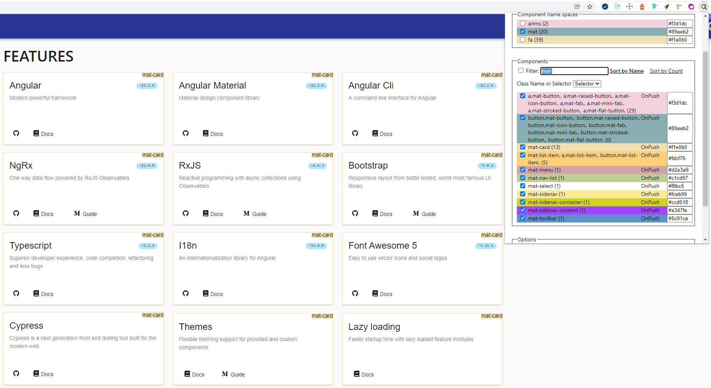

## Angular component outliner

Chrome extension that aims to help visualise application components by drawing a border around components.

It is possible to choose between component namespaces determined by prefix (for example `app` - application components, `mat` - Angular Material components, etc.) or particular components.


There are few options you can choose: class name or selector and label position.

It is possible to filter by component name.
A number in parentheses after component name show instances count of given component.

##### Angular application:
Must be started in [development mode](https://stackoverflow.com/a/67686819/4420532) (`ng` is available in chrome console).

##### Examples:



Chrome Extension [Demo](https://youtu.be/NUdmr3CRHuE)

## Installation

- Clone the repository
- Run `npm install`
- Run `npm run start` 
- Open `chrome://extensions/` in your browser and drag and drop the `dist` folder.


##### Description
The extension is supposed for Angular developers. It works in Angular development mode on port 4200. The rendering engine must be IVY.

After the installation it should be pinned for easier access.

Let's say I am a new developer on a project, and I want to see what components are on the page and how they are organized. The extension
allows me to highlight components and see instantly their boundaries.

Or maybe I am preparing a pull request and want to illustrate the solution. I can take a screenshot of the page with involved components and attach it to the pull request.

The Components can be highlighted by prefix - lets say I want to see all Material components - they have MAT prefix.

Or maybe I am interested in custom application components - the have APP prefix.
Some components may overlap each other.

The other way to highlight a component is to select individual component by name. For example, I want to see ....

I can switch the table to show component selectors instead of names.

If there are many components on the page then I can use filter. Found components are Automatically highlighted.

The extension also shows component instances count and the change detection strategy.

For better experience it is recommended to use display block on all components. I can set default display option for new components in angular.json when using CLI.

```json
{
  "schematics": {
    "@schematics/angular:component": {
      "displayBlock": true
    }
  }
}
```

#### Tags
\#Angular \#ChromeExtension

<!--
The source code can be found on github.
-->


