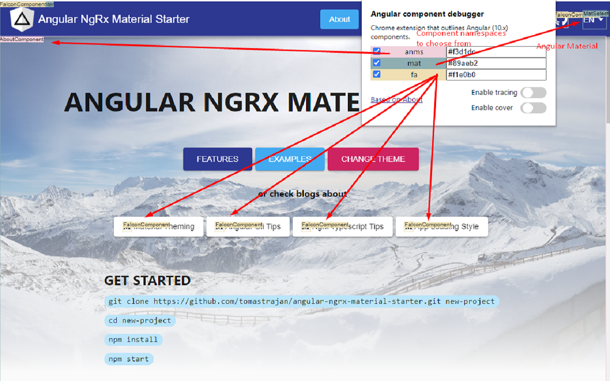

## Angular component outliner

Chrome extension that enables outline of Angular (10.x) components and easily find what given screen consists of. 

Do you want to get a quick overview of components in your Angular application? Just click and see... 

Available in Chrome Web Store
 
Based on a.yurich.zuev: https://chrome.google.com/webstore/detail/angular-tracer-for-view-u/bdneljfoigfojeenmmgahnkjnkpbellg

###### Example:

## Installation

- Clone the repository
- Run `npm install`
- Open `chrome://extensions/` in your browser and drag and drop the `dist` folder.
- Enjoy :)

